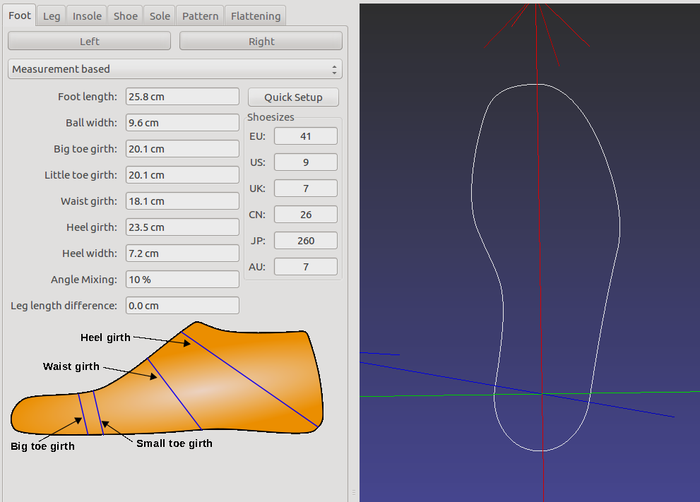
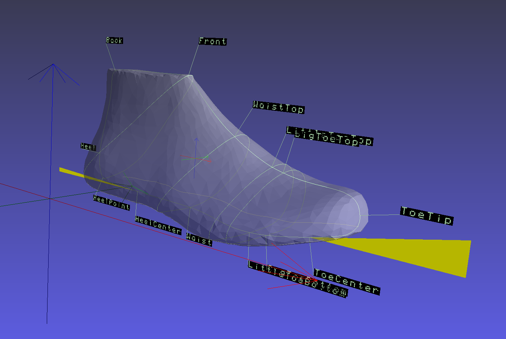
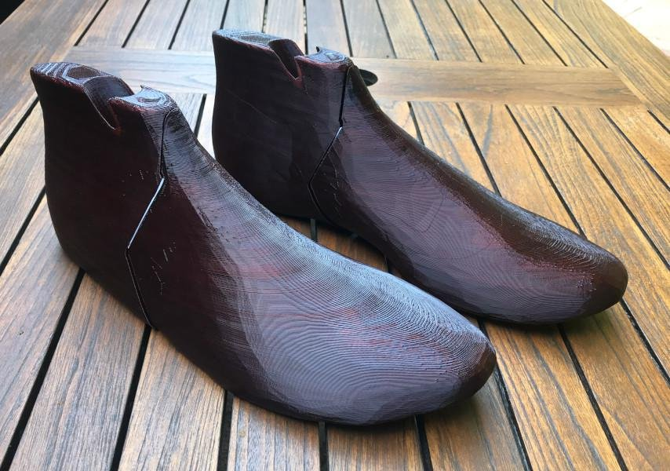

OpenShoeDesigner
================

Shoe design for manufacturing.

[openshoedesigner.net](https://openshoedesigner.net)

# Status

> [!CAUTION]
> The code is not working right now. It will compile, but quickly crash after start because the triangulation algorithm needs fixing.

| Feature | Status |
| ------- | ------ |
| Shoe upper triangulation | In Progress |
| Flattening of patches | Open |
| SDF for heel calculation | Open |
| Last adaption | Open |
| Exporter | Open |
| Design editor | Open |
| Loading and saving | Open |

If this is done, the MVP is reached.

## Summary

Shoe design software with a focus on designing shoes for manual manufacturing.

The software decomposes the shoe into three areas:

 * measurements of the feet
 * pattern for the upper part of the shoe
 * form of the shoe
 
Each of these can be modified independent of the other parts. After 
each modification a build system is running, that render the final shoe design
as well as the parts needed to manufacture the shoe:

 * last
 * flattening of the parts of the upper
 * insole
 * heel
 
These parts are provided as 2D vector-graphics (upper and insole) or 3D models
(last and heel).

## Measurements



Measurements for the feet and for the legs are entered independently of the
design and form of the shoe. Measurements can be stored for each customer an
be reused for generating all different kinds of shoes.

Measurements can specified by just entering the shoe-size (via Quick Setup) and
the rest of the values is calculated from this value using formulas in the
measurement fields. Some or all of these formulas can be replaced by concrete
measurements. 

Since these measurements can be reused it is advised to spend some time on
measuring all the features of the feet and legs.

### Units

Under Preferences -> Setup Units the units for measurements and displayed 
values can be modified. SI units and also imperial units can be selected.

### Last

The last can be loaded from a model or be constructed from the insole of the
shoe. The insole is either constructed, extracted from a imported fixed last or
extracted from an imported heel.



The last is scaled and transformed to the measurements and the form of the shoe
specified.



### Shoe

The setup of the shoe defined the form of shoe by defining the position of the
foot relative to the ground. This is defined by specifying the heel height, the
ball height, the angle of the toes and the angle of the heel. This allows for 
perfectly flat shoes as well as unwalkable heels. 

Also the height of the shoe is specified allowing for low-cut ballerinas up to
tight-high boots.

Using these degrees of freedom, it is possible to derive a woman's and a man's
version of a shoe from the same design.

## Heel

The heel (if needed) is generated algorithmically to automatically adapt to 
different measurements and forms of the shoe.

A walkcycle-support is added, rounding off the platform and the heel of the 
shoe if necessary. This controls how the ankle and the ball move relative to 
the ground, enabling a more natural walking motion even with heeled or 
platform shoes.

## Pattern

A shoe can be topologically seen as a cylinder with a cap at the bottom. The
design of the upper is therefore designed in a cylindrical coordinate system.

A deformed coordinate system is calculated onto the last and the sole and the 
design is projected onto this coordinate system to form the upper of the shoe.
The parts of the design are taken from the 3D space and flattened to 2D. The
deformations of the material is calculated to give an indication, if some parts
need to be split or if the cutouts can be easily sewn and applied to the last.

The final flattened design is exported.

# Building from source

Download the source-files from one of the forges:

 * [Sourceforge](https://sourceforge.net/projects/openshoedesigner/)
 * [GitHub](https://github.com/tobiasfs/openshoedesigner)
 * [Codeberg](https://codeberg.org/tobiassch/openshoedesigner)

Change into the folder of the sources

Run CMake to create the build-directory and build the software within this
folder:

```shell
cmake -B build
cmake --build build -j
```

Running OpenShoeDesigner:

```shell
./build/src/openshoedesigner
```
